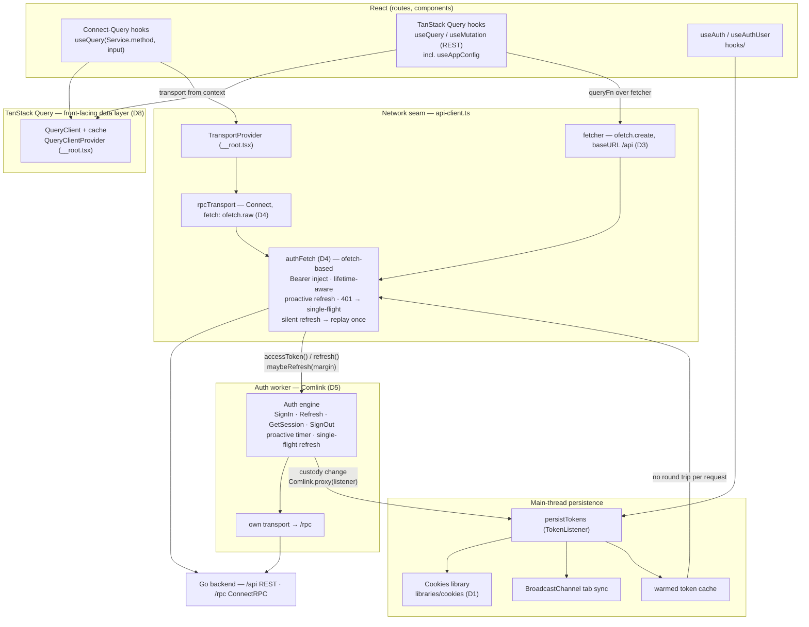

# Frontend foundation: cookies, configuration, Connect-Query

## Objective

Solidify the webapp's foundation before further feature integration: a reusable
cookies library (adopted from ItsBenCodes/cookies `packages/react-cookie`, backed
by `cookie-es`), the guard's cookie persistence rebuilt on it, wire types taken
from the ConnectRPC codegen instead of hand-written zod, a backend-driven
configuration layer aligned with `GET /api/configuration`, an auth-aware shared
fetch layer (Bearer injection, lifetime-aware proactive refresh, single-flight
401 recovery) serving both the ofetch REST client and the Connect transport,
Connect-Query wired into the existing TanStack Query setup, and TanStack Query
established as the front-facing data layer. Backend sources (`internal/guard/`,
`api/connect/`, `modules/appconfig/`) are read as the contract this plan
integrates against — no backend change ships here.

References read 2026-10-09:

- <https://github.com/ItsBenCodes/cookies/tree/main/packages/react-cookie> (README + `src/` — the cookies adoption source)
- <https://github.com/Nekromenzer/cookiz-auth> (README + `src/` — the guard's provider/hook API shape reference; its HttpOnly-cookie transport is rejected — see D9)
- <https://connectrpc.com/docs/web/query/> and the `connect-query-es` README (v2 API: `TransportProvider`, `useQuery(service.method, input)`)
- <https://johnnyreilly.com/web-workers-comlink-vite-tanstack-query> (Comlink + Vite + TanStack Query patterns)
- `docs/api-endpoint.md` — Application Configuration row; the reconciliation date is 2026-09-30.

## Current state

Verified in the tree on 2026-10-09:

- The auth stack lives in `packages/webapp/src/libraries/guard/`: the
  transport-agnostic engine (`auth-engine.ts`, 322 lines) hosting the Connect
  contract calls, the Comlink worker (`auth-token.worker.ts`) exposing it,
  the worker client (`auth-worker-client.ts`) that owns cookie persistence and
  tab sync, the main-thread cookie jar (`auth-cookies.ts`), the store
  (`auth-store.ts`), the bootstrapper (`auth-session.ts`), and the React
  provider (`auth-provider.tsx`).
- `auth-cookies.ts` writes and reads `document.cookie` directly with
  `cookie-es` `serialize`/`parse` (line 25 onward) — six cookie names
  (`saka_token`, `saka_token_exp`, `saka_refresh`, `saka_refresh_exp`,
  `saka_session_id`, `saka_user`), per-item lifetimes, `SameSite=Lax`,
  `Secure` on TLS. There is no shared options object outside this file, but
  the write path bypasses any library.
- Zod appears in three frontend places: `schemas/auth.schema.ts` (the sign-in
  form schema), `auth-cookies.ts` (`tokenBundleSchema`, the jar schema, the
  user schema), `auth-sync.ts` (the BroadcastChannel message schema). The
  codegen at `~/codegen/*_pb` (protoc-gen-es, `task rpc:generate`) already
  types the wire: `SignInRequestSchema` carries `identity`/`password`/
  `remember`; `AuthenticatedUser` carries the profile fields `UserProfile`
  flattens.
- `libraries/cookies/` and `hooks/` exist as empty directories (no files yet).
- `api-client.ts` exports a `QueryClient`, an ofetch `fetcher` (lines 30–56,
  zero consumers in the tree), an `authRetryFetch` wrapper, and the
  `rpcTransport` (Connect transport whose fetch injects the Bearer from the
  auth worker and retries once after a silent refresh).
- `routes/__root.tsx` mounts `QueryClientProvider` and `AuthProvider`; there
  is no `TransportProvider`, and `@connectrpc/connect-query` (`package.json`
  line 16) has zero imports in `src/`.
- `packages/webapp/vite.config.ts` wires `vite-plugin-comlink` for both the
  app and the worker pipeline (lines 54, 148); the worker is constructed
  manually (`new Worker(new URL(...))` + `Comlink.wrap`) with a dead-worker
  recovery swap to a main-thread engine (`auth-worker-client.ts`).
- The webapp owns two Vitest projects (`unit` on happy-dom, `browser` on
  Playwright Chromium) in its `vite.config.ts`; existing guard tests live in
  `packages/webapp/tests/guard/`.
- The backend configuration hand-off: `GET /api/configuration` is Public
  (`internal/guard/rules.go:546`), answered by `modules/appconfig/handler.go`
  (`serveConfiguration`) with the `webutil.Envelope` wrapper
  (`framework/webutil/response.go:57` — `status`/`message`/`data`/`error`/
  `metadata`); `internal/config/publish.go:303` (`Published`) fills the public
  subset anonymous (`app.mode`, `app.base_url`, `app.timezone`,
  `auth.one_time_access_email_as_admin_enabled`,
  `auth.one_time_access_email_as_unauthenticated_enabled`, `oidc.enabled`,
  `mailer.notifications.announcement_email_enabled`) and the full non-secret
  document to an administrator. The DB-backed `SettingsService/ListPublic`
  (anonymous) is a separate product-settings surface, not the deployment
  document.
- E2E (`packages/e2e-tests`) holds only the passkey-ladder flow; no sign-in
  E2E exists.

## Decisions

- **D1 (2026-10-09) — cookies library shape.** Adopt the ItsBenCodes/cookies
  `packages/react-cookie` surface — a `Cookies` class (`get`/`getAll`/`set`/
  `remove`/change listeners/`update()`), a `CookiesProvider` with
  `defaultSetOptions`, and a `useCookies([dependencies])` hook — implemented
  over `cookie-es` (`parse`/`serialize`) instead of `universal-cookie`.
  Rejected: `universal-cookie` as a dependency (cookie-es is already in the
  stack and its parse/serialize is what the guard uses today); the
  `withCookies` HOC (class components, redundant beside hooks in React 19);
  the SSR/server props (the SPA has no server render — the Go shell owns the
  document).
- **D2 (2026-10-09, owner) — zod scope.** Wire types come from the ConnectRPC
  codegen: `LoginCredentials` and `UserProfile` are replaced by proto-derived
  types (`SignInRequest`-shaped input, the `AuthenticatedUser` projection);
  `schemas/auth.schema.ts` is deleted. Zod remains only for the untrusted
  boundaries proto does not cover: the cookie jar, the BroadcastChannel
  message, and the REST envelope of `/api/configuration`. Rejected: removing
  zod entirely with hand-rolled guards (the guards are exactly the work zod
  does, and a hand-tampered cookie must never throw at boot); keeping the
  status quo (leaves the proto/code duplication the owner flagged).
- **D3 (2026-10-09, owner) — fetcher stays as the REST client.** The ofetch
  `fetcher` is retained — the API surface carries REST endpoints beside the
  RPC ones (the profile-picture PUT/DELETE routes, the tus discovery) and
  more will land. It gains the same auth awareness the Connect transport has
  (D4). Rejected: dropping ofetch (the owner keeps the REST path; Connect
  cannot carry a raw-body upload or a tus session).
- **D4 (2026-10-09, owner) — one ofetch-based fetch for both clients.**
  ofetch is the single HTTP engine under the network seam (owner
  correction, 2026-10-09). A shared `authFetch(input, init)` becomes the
  single seam: it injects the Bearer from the auth worker's cached token,
  refreshes proactively when the access token's lifetime is within the
  safety margin (`maybeRefresh(margin)` — not only on a refused 401), and on
  a 401 runs the engine's single-flight silent refresh and replays once.
  `fetcher` becomes `ofetch.create({ baseURL })` with the auth hooks living
  in the seam, and the Connect transport rides ofetch too —
  `createConnectTransport({ baseUrl, fetch })` where `fetch` is the
  ofetch-based wrapper built on `ofetch.raw` (its `FetchResponse` extends
  the native `Response`, so connect-web accepts it); the duplicated
  per-client hooks (`onRequest`/`onResponseError`, `authRetryFetch`) and the
  direct `fetch` calls collapse into it. The refresh itself rides the
  engine's own transport, so a replay can never recurse. Rejected: keeping
  two HTTP engines (plain `fetch` under Connect, ofetch under REST — drift
  between the two paths is exactly the residue this plan removes); token
  expiry math on the main thread outside the engine (the worker owns
  custody — the main thread reads only the warmed cache). The streaming
  shape (`ofetch.raw` carrying the response stream to connect-web's
  server-streaming procedures, e.g. `WatchNotifications`) is validated in
  Phase 4 — if ofetch chokes on it, the transport's fetch falls back to
  plain `fetch` behind the same seam and the fallback is recorded here.
- **D5 (2026-10-09) — Comlink wiring stays manual.** `new Worker(new URL(…))`
  + `Comlink.wrap` remains, because the dead-worker recovery swap to the
  main-thread engine depends on the handle the plugin's `ComlinkWorker` macro
  hides. The `vite-plugin-comlink` plugin stays for bundling. Rejected:
  migrating to `ComlinkWorker` (the johnnyreilly pattern) — it would drop the
  recovery path the cookie restore depends on.
- **D6 (2026-10-09) — hooks home.** `packages/webapp/src/hooks/` becomes the
  shared hooks home; the guard's React-facing hooks (`useAuth`, `useAuthUser`,
  `useAuthentication`) move there from `auth-provider.tsx`, and the new
  `useAppConfig` lands beside them. Rejected: keeping auth hooks inside
  `auth-provider.tsx` (the empty `hooks/` directory exists for exactly this
  layer and cross-feature hooks need a home that is not one library's).
- **D7 (2026-10-09) — configuration source.** The frontend reads the
  deployment document `GET /api/configuration` (public subset anonymous)
  through `fetcher` under a TanStack Query hook, envelope-validated per D2,
  refetched when the auth state flips (the administrator scope widening —
  the bearer the fetcher injects is what widens it). Features gate their
  surfaces on this document — e.g. the one-time-access and OIDC toggles
  decide what the login screen offers. Rejected: `SettingsService/ListPublic`
  as the boot source (that is the DB-backed product settings catalog, a
  different surface; it gets consumed by the phases that need it, not by the
  foundation); a module-level fetch at boot outside the query cache (loses
  invalidation and the devtools view).
- **D8 (2026-10-09, owner) — TanStack Query is the front-facing layer.**
  Components and hooks consume data through query hooks only: ConnectRPC
  procedures through the Connect-Query hooks, REST endpoints through plain
  TanStack `useQuery`/`useMutation` options built on `fetcher`. Neither
  `fetcher` nor `rpcTransport` is called directly from a component; they
  exist as the transports the hooks drive. Rejected: letting features import
  the clients directly (scatters cache ownership, defeats invalidation and
  the devtools view the query layer exists to give).
- **D9 (2026-10-09, owner) — heavy work off the main thread; cookie custody
  is the SPA's alone.** Work that can block the UI (computation, parsing,
  crypto-adjacent shaping, bulk transforms) runs in Comlink workers — the
  auth worker is the pattern, and a feature worker follows the same shape
  (typed proxy, main-thread fallback when workers are unavailable). The
  backend never sets HttpOnly cookies: the token pair and the session
  information live in cookies the frontend owns, written and cleared
  exclusively through the worker's custody-change listener — the worker
  holds the live pair, the cookie copy is its mirror, and no backend
  `Set-Cookie` participates in the session's custody. Rejected: trusting a
  backend-set HttpOnly session cookie (the auth design answers tokens in
  the response body); running heavy work on the main thread "for
  simplicity" (the responsiveness cost is the bug this rule prevents).
- **D10 (2026-10-09, owner) — guard is authn now, authz later.**
  `libraries/guard/` is the frontend's home for both authentication and
  authorization; this plan ships only the authentication half. The backend
  already provides the RBAC surface (`saka.authz.v1.AuthorizationService` —
  roles, permissions, grants per `docs/api-endpoint.md`), and its frontend
  integration (permission-aware guards, role-gated routes and UI) is
  deferred to a later plan — nothing of it is built here. The shape the
  auth half lands in anticipates the second half: the store carries the
  profile the permission checks will hang beside, and the `guard` namespace
  stays generic (no `auth`-only vocabulary baked into shared names).

## Shape and enforcement points

- New: `packages/webapp/src/libraries/cookies/` — `cookies.ts` (the `Cookies`
  class over cookie-es: get/getAll/set/remove, change listeners with the
  interval tick and `update()`, `defaultSetOptions`, an exported default
  instance the guard reads outside React), `cookies-context.ts`,
  `cookies-provider.tsx`, `use-cookies.ts`, `types.ts`, `index.ts`.
- New: `packages/webapp/src/hooks/` — `use-auth.ts` (moved from the provider)
  and `use-app-config.ts` (`/api/configuration` query + envelope parsing).
- New: `packages/webapp/src/libraries/app-config.ts` — the fetcher call + zod
  envelope/document types for `/api/configuration`.
- New: `libraries/api-client.ts` gains `authFetch` — the shared
  ofetch-based, Bearer-injecting, lifetime-aware, 401-recovering fetch (D4)
  that both `fetcher` and `rpcTransport` ride; the per-client hooks collapse
  into it.
- Modified: `routes/__root.tsx` (`CookiesProvider` inside `UIProvider`,
  `TransportProvider` inside `QueryClientProvider`); `guard/auth-cookies.ts`
  (rebuilt on the `Cookies` instance, profile typed from the proto shape);
  `guard/auth-engine.ts` and `auth-worker-client.ts` (input types from
  codegen); `guard/auth-provider.tsx` (hooks moved out); `routes/(auth)/login.tsx`
  (proto-typed form values); `libraries/api-client.ts` (`authFetch` in,
  `fetcher`/`rpcTransport` rebuilt on it).
- Deleted: `packages/webapp/src/schemas/auth.schema.ts`.
- Enforcement points:
  - No `document.cookie` outside `libraries/cookies/` (the guard persistence
    goes through the `Cookies` instance).
  - Zod imports confined to the untrusted-boundary parsers (cookie jar, sync
    message, REST envelope); no hand-written wire interfaces — wire types are
    imported from `~/codegen/*_pb`.
  - All ConnectRPC calls ride the shared transports (worker engine's own, or
    the `TransportProvider` transport); no ad-hoc network calls besides the
    configuration fetch.
  - Features read capability toggles from the configuration store, never
    hard-code them.
  - Heavy, UI-blocking work runs in Comlink workers (D9); the main thread
    never reimplements what the worker owns.

## Architecture

The correlation of the four pieces — Comlink, ConnectRPC, `fetcher`, TanStack
Query — as this plan wires them. TanStack Query is the front-facing layer
(D8); both clients ride the one `authFetch` seam (D4); the worker owns token
custody (D5) and the main thread persists what the engine reports.

Read paths worth pinning:

- The worker's engine carries its **own** transport for the auth procedures
  (`SignIn`/`Refresh`/`SignOut`/`GetSession`) — a refresh can never recurse
  through `authFetch`.
- The main thread does **not** pay a Comlink round trip per request: the
  custody-change listener warms a local token cache `authFetch` reads first;
  the engine is consulted only when the cache is empty or expired.
- The cookie jar is written **only** by the custody-change listener — the
  cookies can never lag the worker's live pair; `restore()` hands them back
  at boot.
- Sign-out clears the query cache (a re-login as another account must never
  render the previous account's data); the login path clears it too.

## Execution rules

- Atomic commit per phase is authorized (owner, 2026-10-09); each phase's
  heading names its suggested commit message; per-phase validation runs before
  each commit; the standing commit rule (explicit paths, no push) resumes when
  the plan completes, with the closing message recommended at handover.
- Self-contained commits during this session are allowed.
- No migration is touched by this plan; the development database reset remains
  authorized but is not expected (no backend change).
- No backward compatibility or legacy shims — the project is early-stage
  (owner, 2026-10-09).
- Comments state invariants only; no phase markers.

## Phases

### Phase 1 — Cookies library on cookie-es

Build `libraries/cookies/` per the shape above: the `Cookies` class (change
detection via the one-second interval tick, like `universal-cookie`), the
context, the provider with `defaultSetOptions`, the `useCookies` hook with
dependency-scoped re-renders, and the default instance export for non-React
consumers. Mount `CookiesProvider` in `__root.tsx`. Unit tests for the class
(get/set/remove round-trip, listener firing, dependency-scoped hook updates)
in `packages/webapp/tests/`.

Validation: webapp `unit` project green; `vp run typecheck`; `task lint`.
Suggested commit: `feat(webapp): cookies library adopted from react-cookie on cookie-es`

### Phase 2 — Guard persistence on the cookies library, proto wire types

Rebuild `guard/auth-cookies.ts` on the `Cookies` instance (same six names, same
per-item lifetimes, same Lax/Secure posture — only the transport under them
changes). Type the pair and the profile from codegen (`TokenBundle` stays —
it is a client-side custody shape — but `UserProfile` is derived from the
`AuthenticatedUser` projection and `LoginCredentials` from the
`SignInRequest` shape). Delete `schemas/auth.schema.ts`; update the login
route's form and the engine/client call sites. Zod stays only for the jar and
sync-message parsers (D2). Update the guard tests.

Validation: webapp `unit` + `browser` projects green; `vp run typecheck`;
`task lint`.
Suggested commit: `refactor(webapp): guard persistence on the cookies library, proto wire types`

### Phase 3 — Backend-driven configuration layer

Add `libraries/app-config.ts` (`GET /api/configuration` through `fetcher`,
envelope-validated, typed from the `Published` public subset) and
`hooks/use-app-config.ts` (TanStack Query, refetch on auth flip). The
configuration exposes the public toggles features read (one-time access,
OIDC, announcement email, mode/base URL/timezone). No consumer surface yet
beyond the hook itself and a login-screen read where a toggle naturally gates
an option — the phase ships the foundation, not features.

Validation: webapp `unit` tests for the parser (envelope shape, malformed
body, admin-scope refetch behavior mocked); `vp run typecheck`; `task lint`.
Suggested commit: `feat(webapp): backend-driven configuration layer`

### Phase 4 — Auth-aware shared fetch, Connect-Query transport, hooks home

Introduce `authFetch` in `api-client.ts` and collapse the duplicated auth
paths into it: Bearer injection from the worker's warmed cache, a proactive
`maybeRefresh(margin)` when the access token's lifetime is inside the
safety margin, and the single-flight 401 → silent-refresh → replay-once
recovery — all built on ofetch (D4). `fetcher` becomes
`ofetch.create({ baseURL })` under the seam (dropping its own
`onRequest`/`onResponseError` pair) and `rpcTransport` takes the
ofetch-based wrapper (`ofetch.raw`) as its `fetch` (dropping
`authRetryFetch`). Wrap `TransportProvider` around the shared
`rpcTransport` inside the existing `QueryClientProvider` in `__root.tsx`.
Move `useAuth`/`useAuthUser`/`useAuthentication` into `hooks/use-auth.ts`
and repoint the imports. Wire the auth↔cache integration the connect-query
adoption implies: the sign-in path clears the query cache (account switch
must never render the previous account's data) alongside the existing
logout clear.

Validation: webapp `unit` tests for `authFetch` (bearer injected, 401 →
refresh → replay, non-recoverable 401 falls through, lifetime margin
triggers the proactive refresh); a streaming probe confirms connect-web's
server-streaming path rides `ofetch.raw` intact (else the recorded D4
fallback applies); `unit` + `browser` projects green; `vp run typecheck`;
`task lint`; the dev probe (`task dev` against the Go backend) shows a
sign-in → query → sign-out cycle with no stale-cache render.
Suggested commit: `feat(webapp): auth-aware shared fetch, connect-query transport`

### Phase 5 — Residue cleanup

Sweep the leftovers the phases expose: the now-dead `authRetryFetch` and the
per-client retry options the unified `authFetch` replaces, unused imports
and stale comments referencing the old wiring, and any dead code the guard
refactor left behind. **`fetcher` stays** — ofetch is the REST client the
upcoming feature phases use (D3); nothing about ofetch is removed.

Validation: webapp `unit` + `browser` projects green; `vp run typecheck`;
`task lint`; grep confirms no reference to the removed internals remains
while `fetcher`/`ofetch` are intact.
Suggested commit: `refactor(webapp): sweep the foundation residue`

### Phase 6 — E2E: the session foundation flow

Add `packages/e2e-tests/workflow/session-foundation.test.ts`: a real Chromium
drives the SPA the webServer boots (the same debug-build harness the
passkey-ladder uses, seed admin `admin` / `@dmin123`). The acts: open the
login route (the configuration fetch fires; a disabled toggle's option stays
hidden), sign in through the form, land in the signed-in shell, reload and
observe the cookie-restore path (no login flash, the profile renders before
the network answers), and sign out back to the login route. This is the
composition-root-level proof the unit and browser projects cannot give.

Validation: `pnpm -C packages/e2e-tests exec playwright test --project=Chromium`
green (the package's scripts are the headed variants).
Suggested commit: `test(e2e): the session foundation flow`

### Phase 7 — Final validation, docs sync, handover

The full matrix below runs green. Docs sync: `.llms/rules.md` (the frontend
rows gain the cookies-library and configuration-layer contracts), 
`.llms/architecture.md` (the library decision records: D1, D2, D4, D7),
`.llms/index.md` if the map's claims shift, `docs/` only where a human-facing
behavior changed. Handover document in `.llms/handover/`.

Validation: the full test matrix; a probe against a freshly built
`build/release/saka serve --env-file=.env.local` (sign-in, session restore on
reload, configuration fetch, sign-out).
Suggested commit: `docs: sync the frontend foundation contracts`

## Test matrix

| What | How | Green |
| --- | --- | --- |
| `Cookies` class semantics (get/set/remove, per-call options, change listeners, `update()`) | webapp `unit` (happy-dom) | assertions pass |
| `useCookies` hook (dependency-scoped re-render, provider absent → throws) | webapp `unit` with a rendered hook | assertions pass |
| Guard cookie persistence through the `Cookies` instance (write/clear/restore round-trip, tampered cookie → null, expired pair dropped) | webapp `unit` — the existing `tests/guard/auth-cookies.test.ts` updated | assertions pass |
| Auth engine custody semantics (rotation, single-flight refresh, dead-pair drop, sync echo suppression) | webapp `unit` — existing `auth-engine.test.ts`, `auth-session.test.ts` unchanged in intent | assertions pass |
| Configuration layer (envelope parse, malformed body refused, public subset shape) | webapp `unit` with a mocked `fetch` | assertions pass |
| Engine in a real worker realm | webapp `browser` (Playwright Chromium) — existing `auth-engine.browser.test.ts` | assertions pass |
| Package hygiene | `vp run typecheck`, `task lint` per phase | clean |
| Composition root | fresh `build/release/saka serve --env-file=.env.local` probe: sign-in → reload restores from cookies → configuration fetch fires → sign-out clears | probe observed |
| The session foundation flow end to end | `packages/e2e-tests/workflow/session-foundation.test.ts` against the webServer's debug build (Phase 6) | Playwright green |
| Contract stamp | `task rpc:lint` (no proto change expected) | clean |

## Explicitly out of scope

- Any backend change: `internal/guard/`, `api/connect/`, `modules/appconfig/`
  stay untouched — they are the contract.
- The MFA challenge UI (`mfa_required` still refuses loudly in the engine).
- HttpOnly cookies (the backend answers tokens in the body, not `Set-Cookie`
  — the auth design's recorded posture; the JS-readable pair is bounded by
  rotation).
- OAuth SSO, passkey, device-login, or any other feature flow's UI — only the
  foundation they will land on.
- `SettingsService/ListPublic` consumption (the product-settings surface gets
  its own phase when a feature needs it).
- The authorization half of `libraries/guard/`: frontend RBAC over the
  backend's `saka.authz.v1.AuthorizationService` (route/permission guards,
  role-gated UI) — the backend ships it, the frontend integration is a
  future plan (D10).
- i18n and theming changes beyond what the provider mount requires.
