# Wave 1.5 — the authz foundation

## Objective

Land `.llms/integration-roadmap.md` Wave 1.5 ("the authz foundation", owner
decisions 2026-10-09): the access token's `roles`/`permissions` claims decoded
into the session store at every custody change, a TS port of the
`framework/authz` matcher exposed as a `can(requirement)` primitive, the
`usePermissions()` / `<Can>` React ergonomics with the administrator signal,
and the refusal-wording surface corrected to what the wire actually answers.
The five roadmap checkboxes under the wave head are the rows this plan closes.
The flow reference is the roadmap's Wave 1.5 section itself (read 2026-10-09,
owner-settled): grants source = the token's claims, engine = homegrown TS port
of the Unkey-adapted `framework/authz` model, matching semantics = the
`resource:instance:action` slug with the wildcard in the instance position
only. CASL is explicitly not adopted.

## Current state

Every claim below verified in the tree on 2026-10-10.

**Backend — what the token carries and how refusals map (read-only for this
plan):**

- `pkg/jwtutils/access.go:33-35` — `AccessClaims.Roles` (`json:"roles,omitzero"`)
  and `AccessClaims.Permissions` (`json:"permissions,omitzero"`): the
  mint-time snapshot of the account's role names and effective grants (the
  roles' sets plus direct grants). Both are omitted from tokens that name
  neither, so an absent claim is an empty set. The renewal re-reads the
  account, so a refresh replaces the snapshot.
- The mints fill the claims: `modules/identity/signin/service.go:792` (the
  sign-in mint) and `modules/identity/session/service.go:594` (the refresh)
  both call `user.LoadGrants` before signing — the payload the frontend will
  decode is live on every pair the backend issues today.
- `pkg/jwtutils/access.go:46-49` — the same type carries `ActorID` /
  `ActorUsername`; not this wave's concern.
- `framework/authz/grants.go:15-31` — `Match(requirement, grant)`: both must
  split into exactly three colon segments, no empty segment anywhere, the
  first and third compare exactly, and the grant's middle segment matches
  either the requirement's or the wildcard `*`. A grant the catalog does not
  declare still matches (the catalog is the seed's input, not the matcher's
  gate).
- `framework/authz/grants.go:33-38` — `Grants(held, requirement)`: one match
  in the held set satisfies; the empty set satisfies nothing.
- `framework/authz/authz_test.go:11-22` — the Go match table (nine pairs:
  exact, wildcard instance, different instance/resource/action, wildcard
  action, wildcard resource, two-part slug, empty segments). This table is
  the cross-check source for the TS port.
- `internal/guard/guard.go:238-256` — the `Permission` rule: the guard judges
  `authz.Grants(caller.Permissions, requirement)` from the claims snapshot;
  the rule is a pure function of the request.
- `internal/guard/guard.go:36-38` — `ErrPermissionRequired` is the refusal an
  unsatisfied requirement produces.
- `internal/transport/middleware/guard.go:118-128` — `guardError` maps
  `ErrUnauthenticated` → `unauthenticated` and **everything else —
  `ErrPermissionRequired` included — → `not_found`**. No
  `permission_required` or `permission_denied` code ever reaches the client
  from the guard. This is the disclosure rule in `.llms/rules.md` ("A refusal
  is `unauthenticated` (401) or `not_found` (404), never `permission_denied`").
- `internal/authz/catalog.go:103` — `AdministratorRole = "administrator"`, the
  system role the seeder grants the default account.

**Frontend — the seams the work lands on:**

- `packages/webapp/src/libraries/guard/auth-store.ts:13-17` — `AuthState` is
  `{ user, isLoading }`; the store carries no grants today. `clearAuth`
  (`auth-store.ts:51-53`) is the one reset path sign-out and failed
  validation share.
- `packages/webapp/src/libraries/guard/auth-engine.ts:204-218` —
  `takeTokenPair` takes custody of every fresh pair (sign-in, continue-sign-in,
  refresh) and `notify`s it; `restore` (`auth-engine.ts:329-339`) notifies the
  cookie-restored pair too. Every custody change crosses exactly one listener.
- `packages/webapp/src/libraries/guard/auth-worker-client.ts:80-88` —
  `persistTokens` is that single main-thread custody site: it warms the token
  cache, rewrites the cookie jar, and publishes to the other tabs. The decode
  lands here and covers both the worker path and the main-thread fallback
  (`auth-worker-client.ts:207-232`, `235-240`) because both wire the same
  listener.
- `packages/webapp/src/libraries/guard/auth-utils.ts:12-16` — `getErrorMessage`
  already maps `NotFound` and `PermissionDenied`; no authz vocabulary exists
  beyond it.
- `packages/webapp/package.json` — no JWT decode dependency; the claims are
  base64url JSON in the token's middle segment and need none.
- No `usePermissions`, no `<Can>`, no grants consumer exists anywhere in
  `packages/webapp/src` — this wave ships the foundation, Wave 3's admin
  console is its first consumer.

## Decisions

- **D1 (2026-10-10) — the decode lives in `libraries/guard/auth-claims.ts`,
  called from `persistTokens`.** The claims are base64url JSON; a hand-rolled
  split-and-decode (~15 lines) with a zod schema (the access token is an
  untrusted boundary — the rules' zod posture applies) reads `roles` and
  `permissions` as string arrays, tolerating absent claims as empty sets and
  a malformed payload as empty sets with a console warning, never a thrown
  error (a bad claim must not break sign-in). The store action
  `setAuthGrants` writes them beside the profile. Every custody change
  replaces the snapshot; `clearAuth` drops it with the pair. Rejected:
  decoding inside the worker engine (the listener already crosses the
  boundary with the token — a second decode site buys nothing); a JWT
  library (`jwt-decode` et al.) for what the platform's own
  `atob`/`Buffer.from` covers; decoding in `auth-provider` (a second custody
  surface that would drift from `persistTokens`).
- **D2 (2026-10-10) — the matcher port is a segment-exact mirror, and the Go
  test table is the contract.** `libraries/guard/permissions.ts` ships
  `matchRequirement(requirement, grant)` and `grantsSatisfy(held,
  requirement)` with the exact semantics of `framework/authz/grants.go`
  (three segments, no empty segment, exact first/third, wildcard middle only,
  undeclared grants still match). The unit test table is the Go table from
  `framework/authz/authz_test.go:11-22` transcribed pair for pair, plus the
  `Grants` set cases — the same pairs must answer the same on both sides.
  Rejected: CASL (the owner's standing refusal — the model here is flatter
  than subjects/conditions); `path-to-regexp`-style matching (the slug
  grammar is three fixed segments, not paths); a `*` in any position (the
  guard allows it in the instance position only — mirroring anything wider
  would make the UI admit what the server refuses).
- **D3 (2026-10-10) — `can()` reads the store; the hooks ride the store
  subscription, not the query cache.** `can(requirement)` in
  `libraries/guard/permissions-store.ts` answers from `authStore.state`
  grants — synchronous, usable from route guards and interceptors as well as
  React. `usePermissions()` subscribes via `useSelector` (the pattern
  `hooks/use-auth.ts:8` already rides) and returns
  `{ can, isAdministrator }`; `<Can permission="…" fallback?>` renders its
  children when `can` answers true. `isAdministrator` is
  `roles.includes('administrator')` — the `AdministratorRole` value the
  backend seeds (`internal/authz/catalog.go:103`). Rejected: putting grants
  in TanStack Query (grants are session state with token-custody lifetime,
  not server cache); a context provider of its own (the auth store is
  already the single session source); naming anything `admin*` (D10 keeps
  the shared namespace generic).
- **D4 (2026-10-10) — the refusal mapping is a correction, not new codes.**
  The roadmap bullet expected `permission_required`/`permission_denied` codes
  to join the error mapping; the wire check found the guard answers those
  refusals as `not_found` (`internal/transport/middleware/guard.go:118-128`,
  the disclosure rule the rules file records). No backend change is made —
  the owner's Wave 1.5 decisions say "no backend change" — and the frontend
  work is: the map already carries `NotFound`'s word, so a UI check that
  missed a case degrades to the server's `not_found` copy, never a silent
  lie; a unit test pins the two words the guard's refusals actually arrive
  as. The roadmap bullet gets its correction in the closing phase's docs
  sync. Rejected: changing `guardError` to emit a permission code (a backend
  change the wave excludes, and it would weaken the disclosure rule); adding
  a fake `permission_required` entry to the map (mapping a code the server
  never sends is documentation of a fiction).
- **D5 (2026-10-10) — the snapshot is mint-time truth, and the UI treats it
  that way.** The claims change only at custody (sign-in, refresh,
  restore, drop), matching the backend's own contract
  (`pkg/jwtutils/access.go:22-26`: an assignment that changes lands in the
  next token). No UI path refetches grants; the refresh is the refetch.
  Rejected: polling `ListPermissions` (Admin-guarded — an account without
  the role cannot call it, and the catalog is Wave 3's read anyway);
  re-deriving grants from any other source.

## Shape and enforcement points

| Surface | Where it lands | Notes |
| --- | --- | --- |
| Claims decoder | `libraries/guard/auth-claims.ts` — base64url payload split, zod-validated `roles`/`permissions`, absent/malformed → empty sets | No new dependency; the access token is an untrusted boundary |
| Store shape | `authStore.state.grants: { roles: string[], permissions: string[] }`, default `{ roles: [], permissions: [] }`; `setAuthGrants`, cleared by `clearAuth` | Rides the existing `AuthState`; every custody change replaces it |
| Custody wiring | `persistTokens` (`auth-worker-client.ts`) decodes and writes on every notify; the drop path (`tokens === null`) clears | One site covers worker and main-thread fallback paths |
| Matcher port | `libraries/guard/permissions.ts` — `matchRequirement`, `grantsSatisfy` | Segment-exact mirror of `framework/authz/grants.go`; Go table is the test contract |
| `can()` | `libraries/guard/permissions-store.ts` — synchronous read over `authStore.state` | Usable from route guards and interceptors, not only React |
| React ergonomics | `libraries/guard/use-permissions.ts` (`usePermissions()` → `{ can, isAdministrator }`), `libraries/guard/can.tsx` (`<Can permission fallback>`) | Generic names per D10; Wave 3's admin console is the first consumer |
| Refusal words | unit test pinning `getErrorMessage` on the codes the guard answers (`unauthenticated`, `not_found`) | The roadmap bullet's correction rides the closing phase |

No proto change, no REST route, no migration, no job, no email, no audit
event, no guard rule, no settings key, no Yaak row — the wave touches no
shipped surface's contract.

## The grants flow

The one flow the wave builds — the claims' journey from the mint to a render
decision, with the single decode point and the single store:

```mermaid
flowchart LR
    subgraph backend["Backend (unchanged this wave)"]
        MINT["sign-in mint<br/>signin/service.go:792"] --> LOAD["user.LoadGrants<br/>roles + permissions"]
        REFRESH["refresh mint<br/>session/service.go:594"] --> LOAD
        LOAD --> TOKEN["AccessClaims on the JWT<br/>pkg/jwtutils/access.go:33"]
    end

    TOKEN -- "SignIn / Refresh /<br/>restore response" --> PAIR["TokenBundle<br/>(worker custody)"]

    subgraph custody["Main thread — one custody site"]
        PAIR --> NOTIFY["persistTokens<br/>auth-worker-client.ts:80"]
        NOTIFY -- "decode auth-claims.ts" --> CLAIMS["{ roles, permissions }<br/>zod, absent/malformed → [] "]
        CLAIMS --> SETGRANTS["setAuthGrants"]
        CLAIMS --> COOKIES["cookie jar +<br/>tab sync (existing)"]
    end

    subgraph store["authStore.state (memory only)"]
        SETGRANTS --> STATE["grants: { roles, permissions }<br/>user, isLoading"]
        CLEAR["clearAuth<br/>(sign-out / dead pair)"] --> STATE
    end

    subgraph consumers["Readers (this wave ships them)"]
        STATE --> CAN["can(requirement)<br/>permissions-store.ts"]
        STATE --> HOOK["usePermissions()<br/>{ can, isAdministrator }"]
        CAN --> COMPO["&lt;Can permission fallback&gt;"]
        HOOK --> COMPO
    end

    COMPO -- "Wave 3: admin console,<br/>route guards" --> UI["Render decision"]

    GUARD["guard.Permission<br/>(server, same slug grammar)"] -. "the same rule answers twice:<br/>UI hides, server judges" .-> CAN

    SERVERFAIL["a missed UI check"] -- "refusal arrives as<br/>not_found (D4)" --> WORDS["getErrorMessage's<br/>server word"]
```



The invariant the diagram carries: the claims change hands at custody only —
sign-in, refresh, restore, drop — and every reader answers from the store's
snapshot, never from a fresh round trip. The server keeps judging with the
same slug grammar; the UI's copy is a courtesy, the server's word is the law.

## Recommended folder structure

Everything new lives inside the existing `libraries/guard/` namespace — the
foundation stays a guard concern, and no new top-level directory is opened:

```text
packages/webapp/src/
└── libraries/
    └── guard/
        ├── auth-claims.ts            # [new] JWT payload decode → { roles, permissions }, zod-validated
        ├── permissions.ts            # [new] matchRequirement / grantsSatisfy — the TS port of framework/authz
        ├── permissions-store.ts      # [new] can(requirement) — synchronous read over authStore.state
        ├── use-permissions.ts        # [new] usePermissions() → { can, isAdministrator }
        ├── can.tsx                   # [new] <Can permission fallback> — the render gate
        ├── auth-store.ts             # [edit] AuthState gains grants; setAuthGrants; clearAuth resets them
        ├── auth-worker-client.ts     # [edit] persistTokens decodes at custody, clears on drop
        └── auth-utils.ts             # [untouched] getErrorMessage already carries the words (phase 4 pins them)

packages/webapp/tests/
├── guard/
│   ├── auth-claims.test.ts           # decoder: real token, absent claims, malformed payload
│   ├── permissions.test.ts           # the Go table, transcribed pair for pair
│   ├── permissions-store.test.ts     # can() across held sets; isAdministrator
│   ├── auth-store.test.ts            # grants defaults, set, reset
│   ├── auth-utils.test.ts            # [exists] gains the refusal-words pins
│   └── can.browser.test.tsx          # <Can> render + fallback in a rendered tree
└── hooks/
    └── use-permissions.test.tsx      # custody change re-renders the reader
```

Notes the tree carries: the dash-file convention does not apply — none of
these is a route; the `#/*` alias reaches only from inside webapp, and the
guard files import each other with relative paths as they already do;
`can.tsx` is a webapp library component, deliberately not a `uilibs`
primitive (it reads session state, and uilibs stays session-free).

## Execution rules

- Atomic commit per phase is authorized; each phase's heading names its
  suggested commit message; each phase's validation runs before its commit;
  a commit is limited to that phase's files.
- The wave is frontend-only. If any phase turns out to need a migration, a
  proto change, or a backend edit, the phase stops and asks — none is
  pre-authorized. (The standing rule — migrations edited in place, no ALTER,
  dev-DB reset allowed — stays on the books for when backend work is
  authorized.)
- No Yaak updates ride this wave: no endpoint's contract changes.
- `tsr generate` output (`routes.gen.ts`) stays gitignored — never committed.
- The standing commit rule resumes when the plan completes; the closing
  phase's commit is recommended, not self-committed.
- Per-phase validation: `pnpm -C packages/webapp exec vp test --project unit`
  (and `--project browser` where the phase ships components), `pnpm exec tsc
  -p packages/webapp --noEmit`, `task lint`. Go suites run only where a phase
  touches Go (this plan: none).

## Phases

### Phase 1 — Claims into the store — suggested commit: `feat(guard): the access token's grants join the session state`

`libraries/guard/auth-claims.ts` (the decoder: split the JWT, zod-validate
`roles`/`permissions`, empty sets on absence or malformation with a console
warning); `AuthState` gains `grants` with the default empty pair and the
`setAuthGrants` action; `persistTokens` decodes on every custody change and
clears on the drop. `clearAuth` already resets the whole state — extend its
test to pin the grants reset.

Validation: unit tests for the decoder (a real-shaped token fixture, an
absent-claims token, a malformed payload), the store actions, and the custody
wiring's unit surface (the main-thread fallback path — the worker path is the
same listener); existing unit + browser suites stay green.

### Phase 2 — The permission engine — suggested commit: `feat(guard): the permission engine`

`libraries/guard/permissions.ts`: `matchRequirement` and `grantsSatisfy` as
the segment-exact TS mirror of `framework/authz/grants.go`. The unit test
table transcribes `framework/authz/authz_test.go:11-22` pair for pair plus
the set cases (`Grants` across the held set, the empty set satisfies
nothing), with a comment naming the Go file as the cross-check source so a
future change to either side re-checks both.

Validation: the matcher unit suite; `tsc`; lint.

### Phase 3 — React ergonomics and the administrator signal — suggested commit: `feat(guard): the permission hooks and components`

`libraries/guard/permissions-store.ts` (`can(requirement)` over the store),
`libraries/guard/use-permissions.ts` (`usePermissions()` → `{ can,
isAdministrator }`, store subscription via `useSelector` — the pattern
`hooks/use-auth.ts` already rides), and
`libraries/guard/can.tsx` (`<Can permission fallback>` — renders children on
pass, the fallback or nothing otherwise). `isAdministrator` answers
`roles.includes('administrator')`. `Can` is a webapp library component, not a
uilibs primitive — its behavior tests are its story.

Validation: unit tests (`can` across held sets, `isAdministrator` true/false,
`Can` render and fallback) and browser tests (`Can` in a rendered tree with
the store seeded, the fallback branch); existing suites stay green.

### Phase 4 — Refusal mapping pinned — suggested commit: `test(guard): the refusal words the guard answers`

The wire check (D4) found the guard answers `not_found`, not permission
codes. Deliverable: unit tests pinning `getErrorMessage` for the two codes a
guarded surface's refusal arrives as (`Unauthenticated`, `NotFound`) and for
the `PermissionDenied` code service-level refusals do use (the map's own
entry), plus the store's `grants` shape documented at the field. No backend
change, no map change — the phase's product is the pin and the recorded
correction.

Validation: the new unit tests; existing suites stay green.

### Phase 5 — Final validation, docs sync, handover — suggested commit: `docs: sync the authz foundation`

The full matrix runs green. Docs sync: `.llms/rules.md` (the webapp bullet
gains the grants-store, matcher-port, and `can()` contracts — the UI and the
server judge by the same rule), `.llms/architecture.md` (the boundary record:
the TS port's cross-check source, the decode site, the snapshot lifetime —
D1–D5), `.llms/integration-roadmap.md` (Wave 1.5's five boxes ticked, the
refusal-mapping bullet carrying D4's correction), `docs/` where the
human-facing story changes (none — the foundation ships no user-visible
behavior; the product guide gains nothing), and the handover document in
`.llms/handover/`. The frontmatter's phases move with the body in the same
commit.

Validation: the full matrix; the release probe is the E2E suite's own
release-build run (no new probe — no composition-root change; the wave adds
no route, no endpoint, no job).

## Test matrix

| What | How | Green |
| --- | --- | --- |
| Claims decoder (real token, absent claims, malformed payload) | webapp `unit` | assertions pass |
| Store shape (defaults, `setAuthGrants`, `clearAuth` resets grants) | webapp `unit` | assertions pass |
| Custody wiring decodes on sign-in/refresh/restore and clears on drop | webapp `unit` (main-thread fallback path) | assertions pass |
| Matcher port answers as the Go table answers (nine pairs + set cases) | webapp `unit`, cross-checked against `framework/authz/authz_test.go` | same answers both sides |
| `can()` over the store, `isAdministrator` from roles | webapp `unit` | assertions pass |
| `usePermissions()` re-renders on custody; `<Can>` renders/falls back | webapp `browser` | assertions pass |
| Refusal words (`unauthenticated`, `not_found`, `permission_denied`) | webapp `unit` | assertions pass |
| Package hygiene | `tsc -p packages/webapp --noEmit`, `task lint` | clean |
| No backend regression | `go test ./...` (the wave touches no Go, but the suite stamps it) | green |
| E2E | **not applicable** — no consuming UI surface ships in this wave; the browser tests above carry the component behavior | — |

## Explicitly out of scope

- **`ListPermissions` and any catalog-reading screen** — admin-read surfaces;
  Wave 3. The foundation checks against the snapshot alone (roadmap row).
- **Any backend change** — the guard, the matcher, the claims, the catalog,
  and the refusal mapping stay as shipped. The wave is the frontend mirror.
- **The admin console, its route guard, and its shell** — Wave 3; the
  foundation ships the tools (`can`, `isAdministrator`) it will consume.
- **CASL or any authorization library** — the owner's standing refusal.
- **Grant-management UI (roles, direct grants)** — Wave 3's administrative
  surface.
- **Step-up vocabulary in the shared names** — D10's namespace rule stands:
  `Can`/`usePermissions` stay generic; step-up composes on top later.
- **Impersonation-aware permission display** — the actor claims are read
  beside the profile already; acting on them in the UI rides Wave 3.
