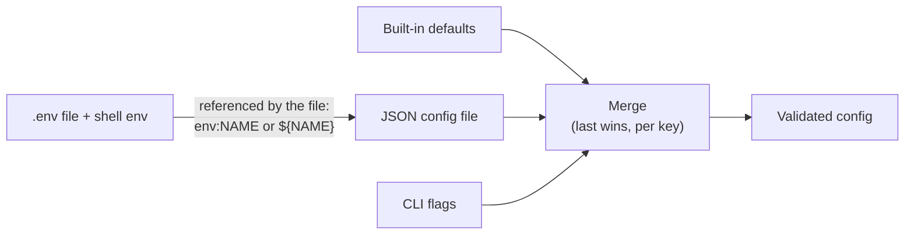

# Configuration

Saka is configured in one place, in one format: a **JSON config file**
(`app.config.json` at the repo root; any path via `--config-file`).
Environment variables and command-line flags exist, but they are not
layers of their own — the file is the source of truth, and everything
else feeds it.



## The three rules worth knowing

1. **The file is required.** A run with no configuration is an error,
   not a silent fallback to defaults — a configuration nobody chose is
   not a configuration.
2. **The environment is not a layer.** A shell export cannot alter a
   run; a variable reaches a key only where the file references it
   (`"env:NAME"` as a whole value, `"${NAME}"` inline). This keeps
   secrets out of the committed file — the file names them, the
   environment carries them.
3. **Merging is per key, not per section.** A file that sets one leaf
   leaves its siblings from the defaults alone; a flag overrides one
   key. Which source last set each key is recorded and inspectable.

## What is configurable

| Group | What it decides | Examples |
| --- | --- | --- |
| `app` | The deployment's identity and URLs | base URL, name, short name |
| `server` | HTTP surface | addresses, timeouts |
| `database` | The PostgreSQL connection | DSN (secret), pool sizes |
| `cache` / `kvstore` | Optional Valkey | endpoints (off = in-process) |
| `storage` | Where files live | local or S3 backend |
| `mailer` | Outbound email | SMTP host/credentials (secret), from address |
| `log` | Log transports and levels | console, file, OTLP |
| `otel` | Tracing and metrics | the collector endpoint, per-signal switches, Prometheus path, the browser-facing collector (`otel.browser`) |
| `queue` | The task queue | concurrency, retention |
| `rate_limit` | The throttles | per-bucket budgets |
| `auth` | Authentication behavior | session lifetimes, one-time-access email switches |
| `oidc` | The identity-provider surface | enablement, token lifetimes |
| `webhook` | Outbound deliveries | the private-network guard |

Durations are written as plain seconds (`900`, not `"15m"` — though the
longer form is accepted). Lists and maps can be written as comma-
separated strings. Unknown keys are dropped rather than fatal.

## Secrets

A secret is a key listed once in the configuration system's `secretKeys`
— and nowhere else. Every rendering path (logs, errors, the
configuration document) reads that list and redacts it. The rules:

- A secret lives in the environment or a dotenv file, referenced from
  the committed config — never typed into the tracked file.
- The tracked config carries placeholders; `task config:validate`
  checks the resolved result before you serve it.
- Sealed at rest: the settings and credentials the server stores in its
  database are encrypted with the application's own cipher, whose key is
  itself a config secret.

## Configuration vs settings — two different things

| | Configuration | Settings |
| --- | --- | --- |
| Where | The JSON file (+ env, flags) | The database, one row per key |
| Changes | Restart to apply | Live, through the admin API |
| Carries | Infrastructure and topology | Product behavior: sign-up modes, password rules, session windows, lockout, MFA limits, passkey limits, token lifetimes, linking toggles |
| Sealed values | Referenced, never inline | A sealed setting's value is encrypted at rest |

The full settings catalog is forty-plus keys, every one with a declared
default, a description, and a public-or-not flag; an anonymous reader
sees only the public subset (via `/api/configuration`), an administrator
sees and updates everything (see
[API endpoints](api-endpoint.md#settings)).

## Verifying a configuration

```sh
task config:validate -- --env-file=.env.local
```

resolves the file against the environment, validates every rule, and
reports unresolved interpolations — the check to run before a deploy or
a certification rehearsal. `task config:generate` writes the sample a
fresh checkout starts from.

---

Back to [Documentation Index](./index.md)
