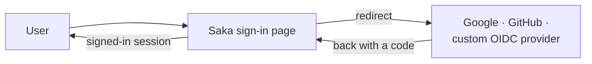

# OAuth SSO: sign in with Google, GitHub, or your own provider

Saka ships with external sign-in built in: a user clicks "Continue with
Google" (or GitHub, or any OpenID Connect provider the operator has
connected), proves who they are on the provider's site, and lands back —
signed in, with no new password to remember.

For the person running Saka, this page explains what can be connected,
how the sign-in behaves, and the rules the system enforces. For the
person signing in, the short version is: use the button, follow the
provider's prompts, and you're in.

## Connecting a provider (administrator)

Three kinds of provider can be connected:

- **Google** — the well-known provider; only a client ID and secret are
  needed.
- **GitHub** — connected the same way; GitHub identifies users through its
  user API rather than an identity token, and the result is the same.
- **Custom OpenID Connect provider** — any other provider (a company's own
  identity service, Auth0, Keycloak, Okta, whatever the organization
  runs). Two ways to configure it:
  - **Discovery** — give Saka the provider's discovery URL once. Saka
    reads and validates the provider's configuration at save time and
    stores the resolved endpoints, so sign-in never depends on the
    provider being reachable at configuration time.
  - **Manual endpoints** — paste the authorization, token, and key
    endpoints directly. They must be HTTPS. If the provider's issuer
    address is nonstandard, issuer checking can be relaxed on that
    connection alone.

Provider secrets are stored encrypted and are never returned after the
fact — a connection's secret can be replaced, not read back.

### Mapping what the provider says to who the user is

Providers differ in what they call things. Each connection can carry an
**attribute mapping** that names which claim holds the user's subject,
email, verified flag, names, username, and picture. Anything left unset
falls back to the standard claim name. A mapping that names a claim the
provider never sends leaves that field empty — it never quietly falls
back to something else, so a typo is visible rather than misleading.

A connection can also define **custom attributes**: extra claims from the
provider (an employee ID, a department) that are stored on the Saka
account alongside the standard profile. Scalars and lists of scalars are
stored as they arrive; objects are refused as a claim source, and a claim
that fails never blocks the sign-in itself.

## Who signs in, and what happens to their account

The sign-in resolves in this order, stopping at the first answer:

1. **Returning user.** If this provider account was linked to a Saka
   account before, that account is signed in.
2. **Same verified email.** If the provider returns an email that is
   verified at the provider, and an existing Saka account carries the
   same address, the two are linked and the user is signed in. This can
   be switched off deployment-wide (`account linking`); when off, the
   sign-in is refused rather than silently merging accounts.
3. **Email check.** If the provider returns an email it has *not*
   verified, the user proves the address is theirs with a one-time code
   sent by email — never a link — before any linking or creation
   happens. Three wrong codes end the flow.
4. **Missing names.** If the account needs first and last names and the
   provider supplied none, the flow pauses and asks for them.
5. **New account.** If the deployment allows open sign-up and nothing
   above matched, an account is created on the fly — username derived
   from the email address, with a suffix if the name is taken.
   Allowlists and blocklists apply here the same way they apply to
   ordinary sign-up.

**Multi-factor sign-in is honored, not bypassed.** If the account has
multi-factor enabled, the OAuth sign-in pauses at the same second-factor
step a password sign-in would — approving the sign-in is what opens the
session, and the provider login alone never does.

**After the first sign-in.** The user sees their linked providers and
can remove one — provided they would not be locked out: the last
remaining way in (another provider, a password, a passkey) cannot be
unlinked. Removing a provider requires proving the current session
(step-up) and, if the account has multi-factor, that factor too.

**Provider tokens are kept for the user's future use** (calling the
provider's API on their behalf). They are stored encrypted, they rotate
on every sign-in, and only the account holder can retrieve them. Saka
refreshes them when they near expiry and — when a refresh fails because
the provider revoked access — signs the binding out and records it,
rather than leaving a dead token behind.

## What this feature is not

It is not enterprise SSO (SAML, directory sync), it does not import
provider logos, and it does not expose provider tokens to other users.
Single sign-in for organizations with their own identity provider *is*
supported — that is the custom OpenID Connect connection — but SAML and
directory synchronization remain out of scope.
