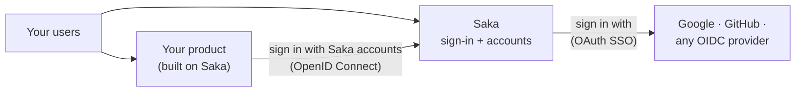
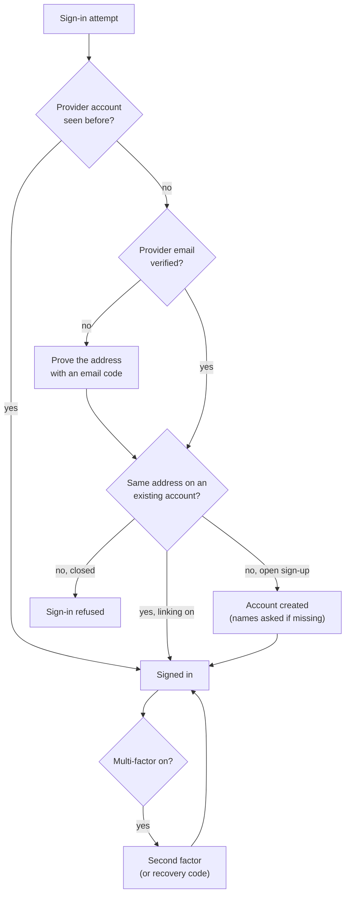

# Saka Product Guide

Saka is a **project boilerplate with authentication built in**. Start a
new product from it and the hardest, most security-sensitive part —
accounts, sign-in, sessions, permissions — already works, tried and
tested. You build your product around it; the auth core is done.

Because the auth core is a full OpenID provider, Saka fits three shapes,
and the same codebase serves all of them:

| Shape | What you use it as | What runs |
| --- | --- | --- |
| **App boilerplate** | Your product's starting codebase | Everything — your features grow beside a finished auth core |
| **Standalone IdP** | Just the identity provider | The sign-in and OpenID surfaces; the rest idles |
| **Both at once** | Your product *and* the identity provider for your other apps | The common case, no extra setup |

The result: your users sign in with Saka accounts, your users' other
apps can too (via the OpenID provider), and your users can reach Saka
through the providers they already have (via OAuth SSO).

---

## Signing in

Saka offers several ways in, and each account can carry several at once —
so losing one never locks the person out.

| Method | How it works | Notes |
| --- | --- | --- |
| **Password** | Email or username plus a password | Configurable length and character-class rules |
| **Passkey** | The device's biometrics or security key | A password can be *removed entirely* once a passkey or linked provider exists — the system refuses to leave an account with no way back in |
| **One-time email code** | An email address plus a short code | Every email flow delivers a **single-use code, never a link** — codes can't leak through preview bots and can't be replayed |
| **External provider** | "Continue with Google/GitHub/custom" | See [OAuth SSO](oauth-sso.md) |
| **One-time access** | A scoped, expiring credential for guests | A contractor or demo gets in without an account |
| **Device code** | The device shows a short code; the user approves it on their browser | For TVs, kiosks, CLIs — the device never sees a password |

**The second factor is honored everywhere.** With multi-factor enabled,
*every* sign-in path — password, one-time code, external provider —
pauses at the same second-factor step: a TOTP authenticator code, with
printable recovery codes as the way back. Sensitive actions can demand a
fresh proof (step-up) even for an already signed-in session.

**Sessions.** Users see every device signed in as them, revoke one, sign
out the others, or sign out everywhere. "Remember me" picks a longer
session window. Administrators can open a support session on a user's
behalf (impersonation) — its own visible, revocable session.

**Recovery.** Forgot-password flows send single-use codes. An
administrator can reset a user's password directly — the user is signed
out everywhere and the act is audited.

---

## Who's who: accounts, groups, roles

| Concept | What it does |
| --- | --- |
| **Users** | A verified email, an optional username, names, a photo, per-user choices (like whether they may delete their own account) |
| **Groups** | Collect users ("editors", "moderators"); whole groups can be granted access |
| **Roles & permissions** | Named capabilities ("create notifications") granted to roles or directly to a user — the API checks this catalog before it answers anything |
| **Blocklist** | Refuses sign-ups (and optionally sign-ins) for particular addresses or domains — disposable-address control for open sign-up |

---

## Letting other applications in

The auth core is a full OpenID provider, so other applications are
first-class citizens:

- **Connected applications** sign their users in with Saka accounts —
  the standard code flow with modern protections, user consent, refresh
  tokens, machine-to-machine credentials, and a device flow. See
  [OpenID provider](oidc.md).
- **Administrators** manage the registered applications (callbacks,
  secrets, logos, per-app extra claims).
- **Users** manage their own consents — they see which applications can
  sign them in and revoke any of them.
- **SCIM** lets an organization's directory synchronize accounts and
  group memberships automatically.
- **API keys** authenticate machine callers (a key is shown once at
  creation, then never again), each with its own expiry and access.
- **Webhooks** deliver signed events to registered URLs when something
  happens in Saka.

---

## The rest of the platform

- **Storage** — file buckets, resumable uploads that survive bad
  networks, expiring signed download links, per-bucket access rules.
- **Notifications** — announcements and targeted notices, to everyone, a
  group, or one user, with read receipts.
- **Audit log** — every security-relevant act (a sign-in, a password
  change, a role grant, a revoked session) recorded with who, what, and
  when, searchable by administrators.
- **Settings** — the deployment's switches (open or invite-only sign-up,
  verification rules, session windows) in one administrator-facing place
  with safe defaults.

---

## Where to go next

- [OAuth SSO](oauth-sso.md) — connecting external providers for sign-in
- [OpenID provider](oidc.md) — how other apps sign users in with Saka,
  and [OIDC profiles](oidc-profiles.md) — which conformance profiles
  Saka supports and why
- [API endpoints](api-endpoint.md) and [API responses](api-response.md) —
  the machine-facing contract
- [Deployment](deployment.md) — running Saka yourself
- [Contributing](contributing.md) — joining the project
