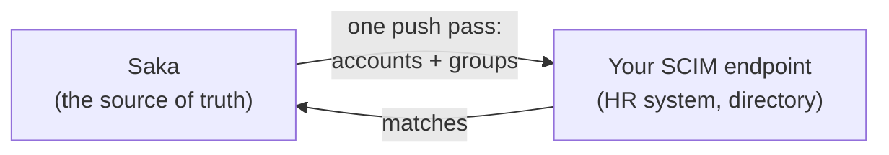

# SCIM provisioning

SCIM is how an organization's user directory stays in step with Saka
without anyone typing. Saka acts as the **SCIM client**: it pushes
accounts and groups out to a remote provider until the remote matches
the local picture.

## How it attaches

Provisioning is configured **per OpenID client**: one provider row names
the remote base URL and the bearer token the sync presents. The token is
stored encrypted and shown exactly once — after that it can be replaced,
not read. When a client stops provisioning, its row is removed; the
accounts it pushed are untouched.

## When it runs

| Moment | Behavior |
| --- | --- |
| Manually | An administrator runs one pass now and sees the counts in the answer |
| Scheduled | Hourly, so drift from other sources self-corrects |
| Debounced | After account or group changes, a short-delay pass follows the change |

A pass pushes until the remote matches the local snapshot — creations,
updates, and deprovisions land in one consistent direction: Saka is the
source of truth, the remote is the mirror.

## Who it serves

The typical fit: an OIDC client whose organization also runs a directory
— the app's access is provisioned by the directory, sign-in goes through
Saka, and nobody creates the same employee twice. The machine-facing
surface is small on purpose: attach, adjust, sync, remove —
[API endpoints](api-endpoint.md#scim-provisioning).
