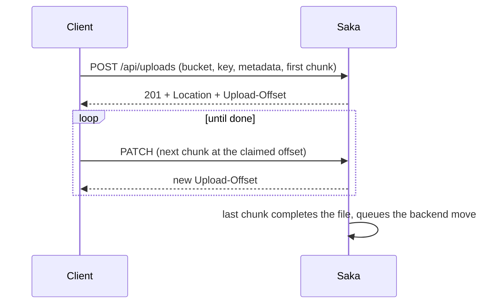

# Storage

Files in Saka live in **buckets**: named namespaces, each with its own
size limit, mime allowlist, and access rules. The storage engine keeps
the objects in a backend of the deployment's choosing — local disk or an
S3-compatible service — and the API on top is the same either way.

## The pieces

| Piece | What it is | Notes |
| --- | --- | --- |
| **Buckets** | Named namespaces for files | Created and administered by an administrator; a non-empty bucket and the deployment's default bucket refuse deletion |
| **File objects** | A file at `bucket`/`key` | Served publicly with immutable cache headers; a miss is a plain 404, never the web app |
| **Resumable uploads** | The tus 1.0.0 protocol, in-house | Stream a file in chunks, probe the offset to resume from, terminate an abandoned session |
| **Signed links** | Expiring URLs that grant download access | For handing a file to someone without an account; the window is a deployment setting |
| **Profile pictures** | The first consumer of the engine | Uploaded raw-body, sniffed by magic bytes (PNG/JPEG/WebP), size-capped, stored in the filestore, referenced by the account |

## How an upload goes

The bucket's size limit and mime allowlist are checked **before any byte
travels**; an append at the wrong offset is refused (the client probes
the true offset with a HEAD and retries). A network drop costs nothing:
HEAD the offset, PATCH from there.

## Administering it

Bucket administration is administrative API — create, update, list,
delete, inspect. The resumable protocol's discovery answers without a
credential; everything else is authenticated. The route tables:
[API endpoints](api-endpoint.md#storage-buckets-saka-only) and
[Resumable uploads](api-endpoint.md#resumable-uploads-tus-saka-only).

---

Back to [Documentation Index](./index.md)
