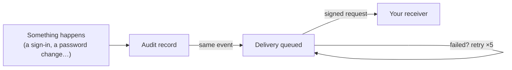

# Webhooks

Webhooks are how other systems hear about what happens in Saka. An
administrator registers a destination — a URL, an HTTP method, optional
custom headers — and subscribes it to the events it cares about. When a
subscribed event occurs, Saka delivers a signed HTTP request describing
it.

## What can be subscribed

Every audit record is a candidate delivery, mapped onto a dot-named
catalog (`user.created`, `session.signed_in`, and so on). The full
catalog is readable through the API. An endpoint that subscribes to
nothing — or to the `*` wildcard — receives **every** event.

## Delivery guarantees and behavior

| Aspect | Behavior |
| --- | --- |
| **Signature** | Every delivery is HMAC-SHA256 signed: a timestamp and the exact body bytes; the receiver verifies both and rejects a replay |
| **Signing secret** | Shown exactly once at creation, stored encrypted, rotatable on demand |
| **Retries** | Five attempts at thirty-second backoff |
| **What fails immediately** | A redirect, most 4xx answers, a disabled endpoint, a host the destination policy refuses |
| **Redirects** | Never followed — signature headers must not land on a different host than the one you registered |
| **Where it can point** | Any public host; loopback, private, and link-local addresses are refused unless the deployment lifts the guard (receivers living beside the server) |
| **Retention** | Attempt records age out at seven days, finished deliveries at thirty |
| **Trying it out** | A built-in test delivery (`webhook.test`) exercises the whole path without a real event |

## Operating it

Administrators register, edit, disable, and delete endpoints; rotate a
signing secret; fire the test delivery; and read the delivery history —
per endpoint or across all of them. The event catalog is listable. Every
procedure is administrative, and the full route table is
[API endpoints](api-endpoint.md#webhooks-saka-only).
