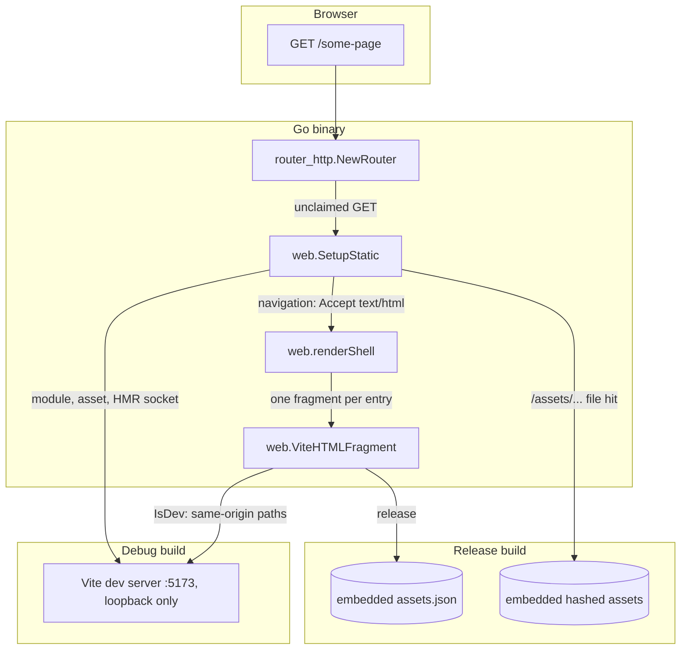

# Web

Web is the SPA surface the Go binary serves: the application document is rendered by Go
(`shell.go`), the assets are built by Vite, and the head tags that bridge the two come from
a fragment engine ported from olivere/vite. There is no `index.html` — the build's input is
the application entry, and every path the routes above it did not claim renders the shell.

> **Origin:** the fragment engine is based on [olivere/vite](https://github.com/olivere/vite)
> (MIT), ported and reduced to what saka serves: one fragment per entry point, resolved
> from the build manifest in release and from the dev server in debug. The handler and
> metadata layers upstream carries were not ported — serving the assets stays with the
> `SetupStatic` seam and the HTML document stays with the shell. Upstream is no longer
> tracked: the engine is owned and evolved by saka.

## Features

- **Go-owned document** — `web/shell.go` renders the whole HTML document; the head a
  crawler reads is served, not fetched around
- **Manifest-driven tags** — the release build resolves every script, stylesheet, and
  modulepreload link from a derived `assets.json` embedded with the binary; Vite's own
  `.vite/manifest.json` stays out of the embed (a dot directory sits below go:embed's floor)
- **Single-origin** — the browser talks to the Go port (:3080) only; the debug build
  proxies the Vite compiler (modules, assets, the HMR socket) behind it
- **Multi-page by contract** — one entry point owns one fragment (`Page` + the input map in
  `vite.config.ts`); a second page carries its own module, styles, and preloads, never
  another page's
- **Escaped by default** — every value a page names goes through `html/template`; the
  fragment is the one trusted-markup input, built from the manifest and never request data
- **Envelope boundaries** — the JSON and protocol surfaces are refused with the responder
  envelope before the shell renders; an API path is never answered with a document
- **Static loader shipped inline** — the loading state the application clears is part of
  the document, minified, so the first paint needs no extra fetch

## Architecture



| Build    | Fragment source                      | Assets served from          |
| -------- | ------------------------------------ | --------------------------- |
| `debug`  | same-origin paths (the proxy answers)| the Go port, via the proxy  |
| `release`| the embedded build manifest          | the embedded `web/output`   |

## Requirements

- Go >= 1.27 (stdlib only — no third-party Go dependency)
- Node >= 24.21, pnpm 12.6.0 for the Vite build (`pnpm exec vite build`)
- A release binary must be built **after** the Vite build: the manifest it resolves comes
  from `web/output`, and a build-order mistake answers the envelope's 500 rather than a
  half-shell

## Wiring

The package lives inside the `saka` module and is not published. `internal/transport`'s
`NewRouter` mounts it last with one call — `web.SetupStatic(r)` — because the SPA answers
whatever the routes above it did not claim; its own not-found and method-not-allowed
boundaries keep API and protocol paths in the envelope. The build pipeline is the
`golang` plugin in `vite.config.ts`: a Vite build compiles the bundle and the email
templates, then rebuilds both Go targets (debug and release) with the new output embedded.

## Quick Start

### 1. Develop

```bash
task dev
```

One command, one origin. The `golang` plugin builds `build/debug/saka`, starts it, and
rebuilds it on every Go change — that is the Go hot reload; Vite keeps the module
transform and the HMR, but the browser never sees it: **:3080** is the only origin, the
shell's fragment carries same-origin paths, and the debug build proxies the compiler's
traffic (modules, assets, the HMR socket) to the loopback dev server.

### 2. Add a Page

Register the entry in `vite.config.ts`'s input map:

```ts
const viteEntries = {
  app: resolve('src/main.tsx'),
  landing: resolve('app/landing.tsx')
}
```

Name the page in Go:

```go
var LandingPage = web.Page{
    Entry:       "landing/main.tsx",
    Title:       "Saka — sign in",
    Description: "Passkey-first sign in",
    Noindex:     false,
}
```

And render it where a route claims the path — the fragment resolves per entry, so the
page gets its own assets:

```go
tags, err := web.ViteHTMLFragment(web.ViteConfig{FS: web.OutputFS(), ViteEntry: web.LandingPage.Entry})
html, err := web.RenderPage(web.LandingPage, tags.Tags)
```

The SPA fallback (`SetupStatic`) renders `DefaultPage`; a page with its own route is
mounted beside it, the way every other chi mount is.

### 3. Build for Release

```bash
SKIP_GO_BUILD=1 pnpm exec vite build   # assets + manifest into web/output
task build                             # both Go targets embed it
```

## Configuration

There is no `web` config section. The one value — the dev server URL — is a constant
(`viteDevURL` in `static_debug.go`): it exists only for a debug build, which a deployment
never serves, and the release build ignores it entirely. The page defaults (title,
description, noindex) are `DefaultPage` in `shell.go`.

## API Reference

### `ViteHTMLFragment(config ViteConfig) (*ViteFragment, error)`

Resolves the head tags for one entry point. In development it names the dev server's
React preamble, `@vite/client`, and the entry module; in production it reads the manifest
from `config.FS` and resolves the entry to its hashed module, stylesheets, and preload
links, following the chunk's imports so a shared chunk's styles ride the page that needs
it. An entry the manifest does not name is an error, never a silent empty tag.

### `ViteConfig`

| Field             | Description                                                                |
| ----------------- | -------------------------------------------------------------------------- |
| `FS`              | The Vite build output; read only in release for the manifest                |
| `IsDev`           | Point the fragment at the dev server instead of the built assets            |
| `ViteEntry`       | The source path the manifest names (`app/main.tsx`); empty asks for the manifest's single entry |
| `ViteURL`         | The origin the same-origin paths ride (dev mode; empty means this origin)   |
| `ViteManifest`    | The manifest path relative to `FS` (default `assets.json`)                  |
| `ViteTemplate`    | The scaffolding whose dev preamble is injected (`ViteReact` or `ViteNone`)  |
| `AssetsURLPrefix` | The prefix the built asset paths ride, for a deployment that keeps artifacts off the document origin |

### `Page` / `DefaultPage`

A page names one document: the build `Entry` whose fragment it embeds plus the `Title`,
`Description`, and `Noindex` the shell renders. `DefaultPage` is the application document
every unmatched GET renders; a later phase registers further pages and turns noindex off
where the surface is public.

### `SetupStatic(r chi.Router)`

Mounts the SPA surface, debug or release by build tag. The handler answers only GET and
HEAD (anything else carries the envelope's method-not-allowed), serves a file hit from the
embedded output, refuses the API and protocol prefixes with the envelope's not-found, and
renders the shell for everything else.

### `RenderPage(page Page, tags template.HTML) (template.HTML, error)`

Renders one document: the page's meta, the fragment handed in, and the loader. The
`html/template` execution is what escapes every value the page carries.

## Testing

Tests are plain Go — no database, no containers. The fragment tests feed a synthetic
multi-entry manifest through `fstest.MapFS`, and the shell tests pin the escaping and the
page vars.

```bash
go test ./web/
go test -race ./web/
```

## Design Decisions

| Decision                                   | Rationale                                                                                        |
| ------------------------------------------ | ------------------------------------------------------------------------------------------------ |
| Ported, not imported                       | The engine is ~600 lines, MIT, and touches presentation the repo owns; no drift, no dependency    |
| No `index.html`                            | One owner for the document; the meta a crawler reads is served by Go, not duplicated in a static file |
| One fragment per entry                     | A second page must not ship the first page's assets; the manifest keys are the contract           |
| Dev server is a constant, not config       | Only a debug build reads it, and a deployment never serves one; config would be a second place to look for a development-only fact |
| One origin: the compiler sits behind Go    | The cookie context, the proxies, and the document have exactly one owner; a second port was two sources of truth |
| Navigation vs everything else              | A navigation's Accept names text/html and a module's never does — one header splits the shell from the compiler's traffic, and the HMR socket rides the same rule |
| `html/template` for the document           | Every page-named value is escaped; the one trusted input (`trustedHead`) is manifest-built, never request data |
| Fragment resolved once, lazily             | The embedded manifest cannot change mid-run; a resolution error answers the envelope's 500        |
| Serving stays with `SetupStatic`           | Upstream's handler was not ported: the router already owns mounts, boundaries, and exclusions     |
| Loader inline and minified                 | The first paint needs no extra fetch; the styles are static, so they ship as one line              |

## Credits

The fragment engine is based on [olivere/vite](https://github.com/olivere/vite) by Oliver
Eilhauer, adapted for the saka architecture.
